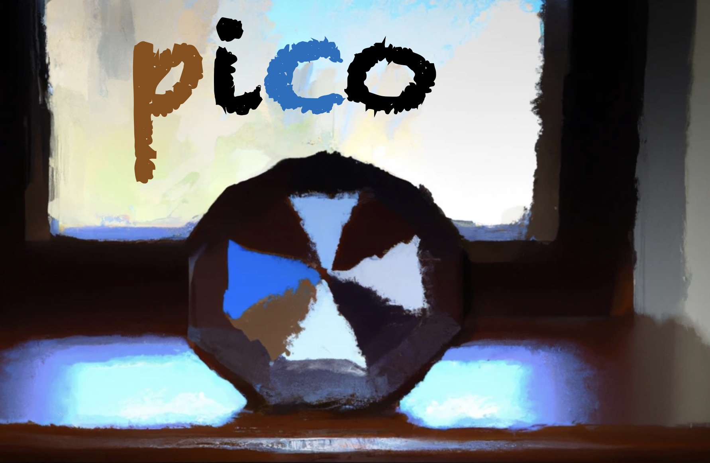

# Pico

# What is Pico?

The Pico suite is a software playground for embedded hardware. It comprises a tiny framework for embedded systems, which decouples application software from the underlying real time operating system (RTOS) by a very thin abstraction layer. In addition, the Pico Suite comes with five tiny sample applications to demonstrate the API usage of the framework.

The Pico API provides some symbol and type definitions, as well as a set of eight API functions, enabling Zephyr novices to get basic tasks easily running on embedded hardware. The API provides the following basics: initializing a console and waiting for console readiness, formatted/colored printing to a console, reading a system clock in microseconds, sleeping for a given number of microseconds, level controlled logging with microsecond timestamps, on/off or toggle control of up to four LEDs, initializing and callback setup for up to four buttons, and button state polling.

Due to its small codebase the Pico framework can be easily adopted to various RTOS types or hardware abstractions (like FreeRTOS or STM32CubeMX). In this paper, however, we describe Pico in a pure Zephyr RTOS context. Due to its tiny size Pico is an excellent context for tutorials, as it allows Zephyr novices to get running on embedded boards with Zephyr without exposing the novice to advanced concepts like kernel configuration and device tree magic during the initial learning phase. Once the reader is familiar with building and running of Pico based Zephyr samples, the reader can tackle the advanced Zephyr concepts in subsequent phases.
